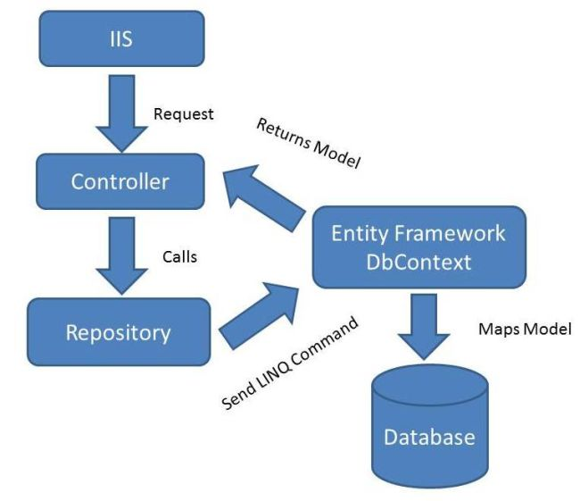

# Repository Pattern
Repository pattern is a design pattern used to separate the logic that retrives data from underlying storage system from rest of the application. It is a part of the broader architectural pattern known as the Data Access Layer.

To understand Repository pattern better, let's consider following diagram.



In general, we write our data access logic within the controller. Which increase code redundancy and  violates the principles of separation of concerns and maintainability in the context of ASP.NET Core MVC. This practice can lead to tightly coupled code, making it challenging to unit test, refactor, and extend the application in a scalable manner.

A better approach is to adhere to the principles of the Repository Pattern and Dependency Injection. By separating data access logic into dedicated repository classes and using dependency injection to inject these repositories into controllers, we can achieve a more modular and maintainable architecture. This allows for easier testing, better code organization, and the ability to switch out data access implementations without affecting the rest of the application.

Here we learn to create and implement Generic Repository with Dotnet Core Project.

# Steps 
- Create the folder named `Repository` in our Project.
- Create the interface named `IRepository` which is more convinient than other names. It serves as the foundational repository interface that will be utilized consistently across the entire project.

```c#
    public interface IRepository<T> where T: class{

        void Add(T entity);
        T Get(Expression<Func<T, bool>> filter);
        void Remove(T entity);
        void RemoveRange(IEnumerable<T> entities);
        public T FindById(int id);

        //.. We can add or remove method signatures as per our needs.

    }

```

- Now, create the class named `Repository` implementing our Repository.
```c#
public class Repository<T>:IRepository<T> where T: class{
    private readonly StudentDbContext _dbContext;
    internal DbSet<T> database;

    public Repository(StudentDbContext dbContext)
    {
        _dbContext = dbContext;
        database = _dbContext.Set<T>();
    }

    public void Add(T entity)
    {
        database.Add(entity);
    }

    public T Get(Expression<Func<T, bool>> filter)
    {
        IQueryable<T> query = database;
        query = query.Where(filter);
        return query.FirstOrDefault();
    }

    public void Remove(T entity)
    {
        database.Remove(entity);
    }

    public void RemoveRange(IEnumerable<T> entities)
    {
        database.RemoveRange(entities);
    }

    public T FindById(int id)
    {
        DbSet<T>? query = database;
        return query.Find(id);
    }
}

```

These components i.e. Class and Interface provides base for implementing the repository pattern in our project. Let's assume that we have Student Model in our project we want to implement repository pattern with. Let's again create two files, i.e. `IStudentRepository.cs` and `StudentRepository.cs` .

```C#
    public interface IStudentRepository:IRepository<Student>{
            void Update(Student model);
            void Save();
    }
```

```C#
    public class StudentRepository:Repository<Student>,IStudentRepository{
        public StudentDbContext _studentDb;
        public StudentRepository(StudentDbContext studentDb):base(studentDb){
            _studentDb = studentDb;
        }
        public void Save()
        {
            _studentDb.SaveChanges();
        }
        public void Update(Student model){
          _studentDb.Student?.Update(model);
        }
    }
```

Now we are ready to go.

Let's come to our controller. Assuming our controller is named `StudentController`.
```C#
public class StudentController : controller{
    public IStudentRepository _studentRepo;
    public StudentController(IStudentRepository studentRepo){
        _studentRepo = studentRepo;
    }
    //Now, we use the object or StudentRepository instead of our DbContexts'.
      public IActionResult StudentView()
     {
        try
        {
            List<Student> student = _studentRepo.GetAll().ToList();
            return View(student);
        }
        catch (Exception ex)
        {
            Console.WriteLine($"Exception .. -> {ex.ToString()}");
            return View(ex);
        }
    }
}

```

So, here we implemented Repository pattern in dotnetcore 6 MVC.

<hr>
<i>HappyCoding🤞</i>